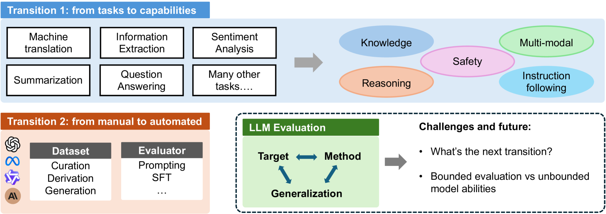

1️⃣ Если evals не дают общей гарантии безопасности, то какие свойства модели вообще имеет смысл пытаться измерять и зачем?
2️⃣ Когда мы говорим, что модель “хорошо работает”, что это вообще может значить?
3️⃣Если evals не дают гарантий, то что, по-вашему, может делать один eval более надежным, чем другой?

На все вопросы по сути один ответ -- мы не можем познать, обеспечить всю безопасность ИИ, но мы можем вводить какие-то метрики, которые замеряют абстрактные качества модели.

### 📚 Обязательный список чтения
🔗 [AI Safety Evaluations: An Explainer](https://cset.georgetown.edu/article/ai-safety-evaluations-an-explainer/)  

Занятна идея Model Safety Evaluations vs. Contextual Safety Evaluations

| Model Safety Evaluations                                                                                           | Contextual Safety Evaluations                                                                                                                        |
| ------------------------------------------------------------------------------------------------------------------ | ---------------------------------------------------------------------------------------------------------------------------------------------------- |
| Can the model perform a specific task, whether desirable or undesirable?                                        | What can a user with access to the model do?                                                                                                         |
| How accurate and reliable are the model’s outputs?                                                                 | Does a model make it easier to access necessary information, provide previously unavailable information, or perform a specific task?                 |
| How good is a model at answering general-purpose questions? Specific questions?                                    | Can an adversarial actor “break through” restrictions or protections?                                                                                |
| What outputs can the model not provide? Are there areas in which the model is unlikely to provide correct answers? | Does access to a model increase a malicious actor’s chance of success or increase the range of options an adversarial actor may consider for a plan? |
| What systemic flaws, biases, or limitations are present in model outputs?                                          | Does a user’s level of expertise impact any of the above questions?                                                                                  |
| How do capabilities compare between models, or over time?                                                          |                                                                                                                                                      |
Понятна идея разницы между конечным итогом и процессом, но всё же перечисленные вопросы наглядно не показывают этого.

Главные вопросы AI evals:
- С какими угрозами безопасности ассоциирована модель?
- Какие результаты работы модели ассоциированы с этими угрозами?
- Как мы можем это измерить?

Как это можно обеспечить?

| Model Safety Evaluations | Contextual Safety Evaluations  |
| ------------------------ | --------------------------------- |
| Benchmarking             | Red teaming                       |
| Capability testing       | Uplift studies                    |
Uplift studies -- замеры того, сколько времени человек тратит на решение задачи с использованием нейронки и без.

В целом -- очередная статья за всё хорошее против всего плохого. 

___________________

🔗 [Toward Generalizable Evaluation in the LLM Era: A Survey Beyond Benchmarks](https://arxiv.org/abs/2504.18838) 

Статья, начинающая за здравие, оканчивающаяся известно на что. Часть про оценки LLM хороша, однако предложения, исходящие из здравой идеи ограничить доступ LLM при обучении к бенчам, довольно слабы. 

Понравились capabilities:
**1. Knowledge** — способность модели точно вспоминать, понимать и применять фактическую информацию. Оценивается через knowledge-intensive вопросы (например, «Кто президент США?»). Ключевые проблемы: галлюцинации, устаревание знаний (temporal dynamics), data contamination.

**2. Reasoning** — способность логически обрабатывать информацию и делать обоснованные выводы. Включает подтипы: математическое рассуждение (MATH, OlympiadBench), рассуждение в коде (HumanEval, LiveCodeBench), commonsense reasoning, планирование (как особый тип — декомпозиция задач). Авторы подчёркивают, что reasoning фундаментально зависит от knowledge.

**3. Instruction Following** — способность понимать и выполнять пользовательские инструкции. В новой парадигме LLM каждый prompt — это по сути отдельная задача, и традиционные NLP-задачи (классификация, extraction) рассматриваются как частный случай instruction following.

**4. Multimodal Understanding** — способность обрабатывать и генерировать контент в разных модальностях (текст, изображения, аудио). Visual instruction tuning связывает визуальное понимание с выполнением инструкций. Оценка расширяет scope за пределы текста.

**5. Safety** — устойчивость модели к генерации вредного, предвзятого или вводящего в заблуждение контента. Включает: toxicity, refusal competence (умение отказать при опасных запросах), truthfulness alignment (приоритет правильных ответов над красиво звучащими заблуждениями). Ортогональна другим capability, но критически важна для deployment.
_______________
🔗 [A statistical approach to model evaluations](https://www.anthropic.com/research/statistical-approach-to-model-evals)

Классная статья про стат тесты разных нейронок на предмет их различия. Чтобы подтвердить гипотезу о различии в eval разных моделей надо
 1. Посчитать стандартные ошибки по ЦПТ
 2. Если вопросы связаны между собой, то считаем кластеризованную стандартную ошибку.
 3. Снижаем дисперсию засчёт ресэмплинга ответов и анализа вероятности следующего токена (???)
 4. При сравнении двух моделей правильнее делать статистические выводы по парному сравнению, а не всех выборок (?) 
5. Использование анализа статистической мощности (??) для тестирования гипотез

Из нового -- кластеризованные стандартные ошибки, когда мы считаем СО не для независимых данных, а разбитых на кластеры. 

___
🔘Кратко опишите свой опыт работы с Inspect: что вам показалось понятным, что осталось не до конца ясным.

Понравилось, что можно достаточно просто переключаться между разными режимами работы LLM, не понравилось, что необходимо учитывать разность датасетов в заданиях.

🔘Какой шаг в ноутбуке лучше всего показал вам, что eval зависит не только от модели, но и от выбора задач, формата и объема оценки?

Переход к chain-of-thoughts.

Связь между теорией и практикой
🔘Вспомните все, что вы читали и делали на практике за две недели. Если рассматривать evaluation strategy, как процесс из трех шагов: what to measure, how to measure it, what the results mean, то какие знания и инструменты у вас уже начали появляться для каждого из этих шагов?

**What to measure** -- благодаря статье

**How to measure it** -- power analysis, доверительные интервалы, кластеризованная стандартная ошибка.

**What the results mean** -- надо учитывать. что формат работы LLM над ответом влияет на результат, что влияет на оценку capability. Модель может хорошо пройти тест по математике, но из этого не следует, что она хорошо знает математику. Кроме того, необходимо учитывать потенциальное наличие в тесте совсем похожих вопросов.

Постарайтесь ответить не в общем виде, а через конкретные элементы курса: идеи из текстов, решения из ноутбука, типы ограничений, способы сравнения и интерпретации результатов.

Примечание: 
Под “инструментами” здесь имеются в виду не только технические методы, но и более общие вещи: знание что именно считается объектом оценки, как выбор benchmark design влияет на результат, и как не переинтерпретировать полученные числа.
