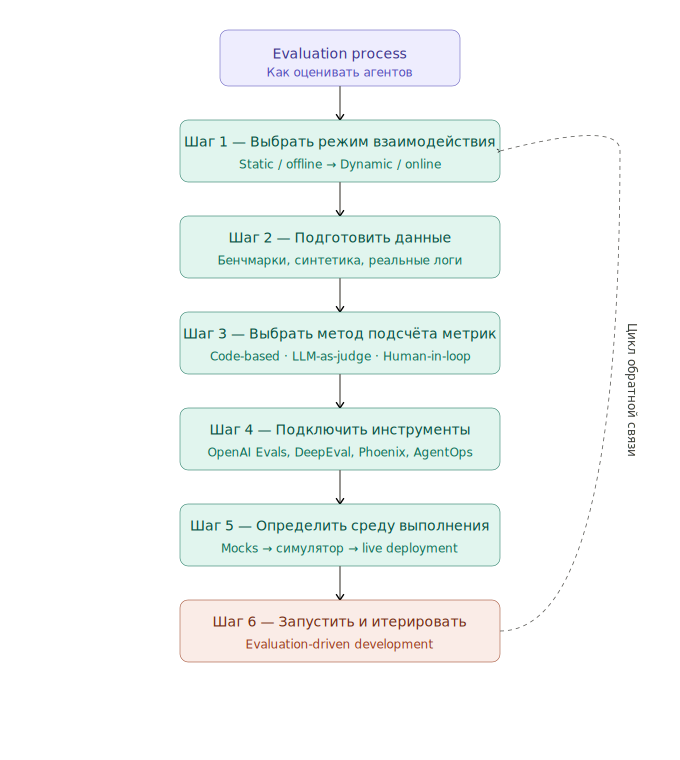
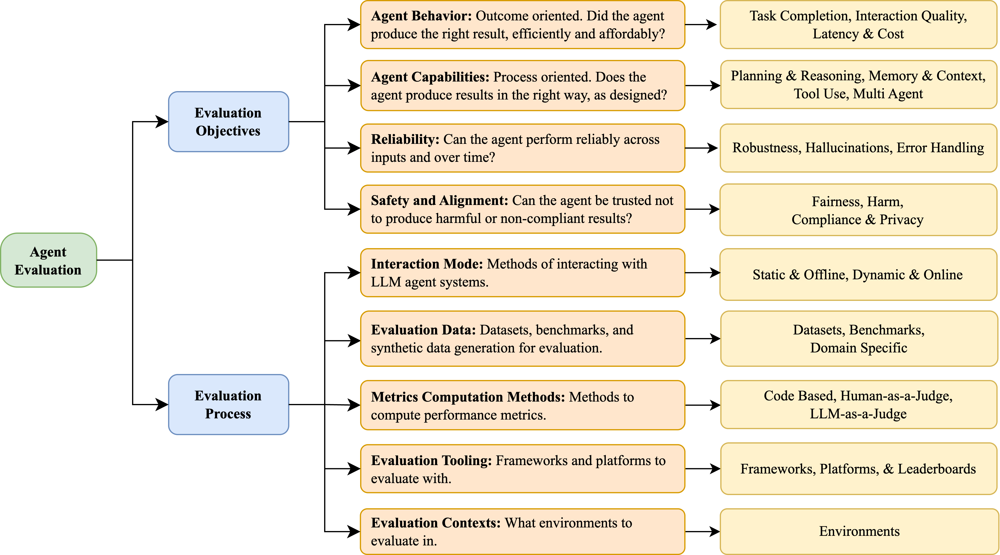

### [Evaluation and Benchmarking of LLM Agents: A Survey](https://arxiv.org/abs/2507.21504)
Добротная обзорная статья. Понравилось,что для многочисленных заданий предлагаются подходящие метрики.
Evaluation Process раскладывается в следующий пайплайн

Сложности в ролевой модели доступа, надёжности, более-менее сложных взаимодействиях и правовых ограничениях. Ожидаемо. 

____
### [Towards a Science of AI Agent Reliability](https://arxiv.org/html/2602.16666v1)

Классная статья, где мы декомпозируем надёжность ИИ-агентов. Учитывая эти составляющие, понятно, что нельзя мерить среднее по больнице. Куча метрик прилагается. В статье больше конкретики, чем в предыдущей.  

| Dimension      | Cross-Domain Notion                                                                                                        | Domain-Specific Exemplars                                                                                                                                                                                                                                                                           |
| -------------- | -------------------------------------------------------------------------------------------------------------------------- | --------------------------------------------------------------------------------------------------------------------------------------------------------------------------------------------------------------------------------------------------------------------------------------------------- |
| Consistency    | Repeatable outcomes under nominal conditions; low variance across repeated trials                                          | FAA requires deterministic execution of flight-critical software [[52](https://arxiv.org/html/2602.16666v1#bib.bib52)]; NRC sets mandatory response times for digital computers in nuclear reactors [[58](https://arxiv.org/html/2602.16666v1#bib.bib58)].                                          |
| Robustness     | Graceful degradation under input, environment, tool perturbations; stable performance across the full operational envelope | NASA investigation of software-related unintended acceleration in Toyota cars leads to recall [[40](https://arxiv.org/html/2602.16666v1#bib.bib40)]; FAA mandates aviation sensor testing at extreme temperatures, turbulence, and vibration [[16](https://arxiv.org/html/2602.16666v1#bib.bib16)]. |
| Predictability | Prediction confidence aligned with accuracy; detect limits and defer/escalate under uncertainty                            | NRC models thousands of potential failure modes in nuclear reactors [[57](https://arxiv.org/html/2602.16666v1#bib.bib57)]; Aviation uses tiered risk classification with explicit probabilities [[17](https://arxiv.org/html/2602.16666v1#bib.bib17)].                                              |
| Safety         | Bounded harm even when failures occur; worst-case severity remains acceptable                                              | SIL 4 standard requires dangerous failure probability less than 10−5 [[22](https://arxiv.org/html/2602.16666v1#bib.bib22)]; FAA uses a one catastrophic error per billion flight hours target [[17](https://arxiv.org/html/2602.16666v1#bib.bib17)].                                                |

_______
### [METR: Guidelines for capability elicitation](https://evaluations.metr.org/elicitation-protocol/)
Набор очевидных замечаний
🔘 почему agent evaluation может занижать реальные возможности модели, если не учитывать elicitation;
Потому что теория != практика
🔘 как использовать dev set не только для улучшения агента, но и для классификации типов провалов;
чтобы проводить классификацию провалов
🔘 чем spurious failure отличается от real failure и tradeoff;
фиксится -- не фиксится -- это фича
🔘 какие red flags стоит проверять, прежде чем интерпретировать итоговый score как meaningful.
разумно оцениваем task и process-level